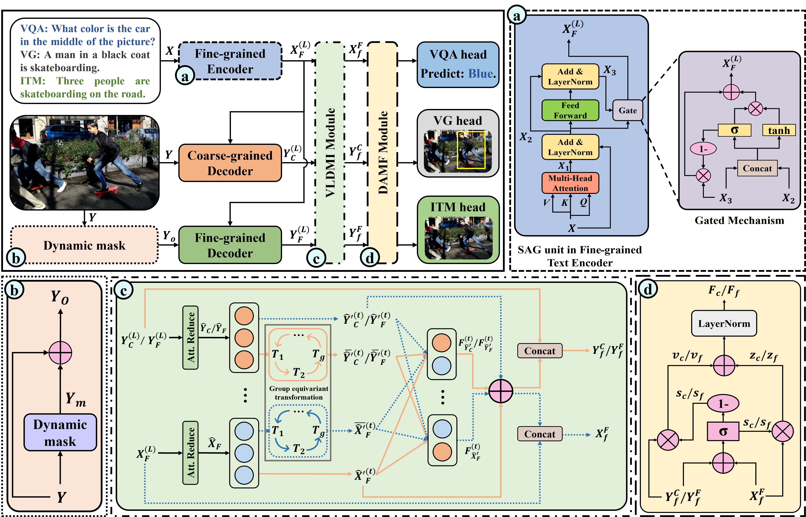

# MGMIF
The source code for the [article](https://doi.org/10.1016/j.engappai.2026.114849) "Multi-Granularity Modal Interaction and Fusion Framework for Vision-Language Tasks".

Abstract:
Effective alignment and fusion of visual and textual features is critical for model performance in vision-language tasks. To overcome the limited adaptivity of static approaches and the optimization instability of dynamic ones, we propose Multi-Granularity Modal Interaction and Fusion (MGMIF), a unified framework that balances adaptivity and stability. Specifically, MGMIF employs a dual-granularity visual decoder and a fine-grained text feature encoder with self-attention gating to learn complementary multi-granularity representations. Subsequently, we introduce a vision-language dynamic interaction module that enhances both intra- and inter-modal feature interaction learning using a dynamic capsule group-equivariant routing scheme, improving stability and robustness. Finally, a dynamic adaptive modal fusion module efficiently integrates high-level semantics across granularities into a compact representation for prediction. Extensive experiments, statistical significance tests, and qualitative analyses validate that MGMIF outperforms strong state-of-the-art baselines across seven benchmark datasets (VQA-v2, GQA, CLEVR, RefCOCO, RefCOCO+, RefCOCOg, and Flickr30K) spanning three vision-language tasks, demonstrating its effectiveness, generalizability, and interpretability.

<p align="center">
	
</p>

To run this code, you may refer to the relevant content on [MCAN](https://github.com/MILVLG/mcan-vqa), [OpenVQA](https://github.com/MILVLG/openvqa) and [MMnasNet](https://github.com/MILVLG/mmnas), or their [MODEL ZOO](https://openvqa.readthedocs.io/en/latest/basic/model_zoo.html).

# Citation
If this repository is helpful for your research, we'd really appreciate it if you could cite the following paper:
```
@article{xu2026multi,
  title={Multi-Granularity Modal Interaction and Fusion framework for vision-language tasks},
  author={Xu, Yangshuyi and Liu, Guangzhong and Shen, Xiang and Wang, Xiuying and Zhou, Huiyu},
  journal={Engineering Applications of Artificial Intelligence},
  volume={178},
  pages={114849},
  year={2026},
  publisher={Elsevier}
}
```
